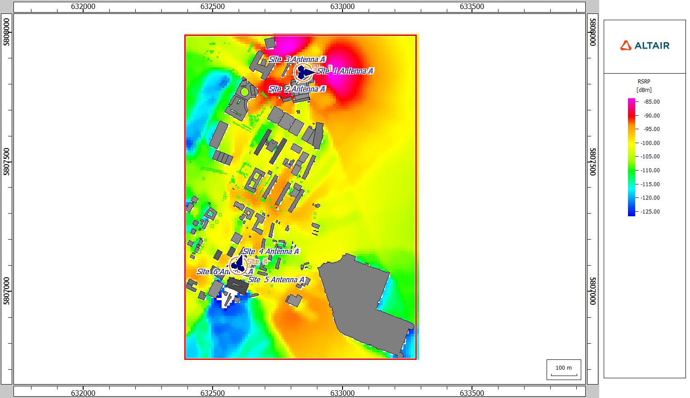
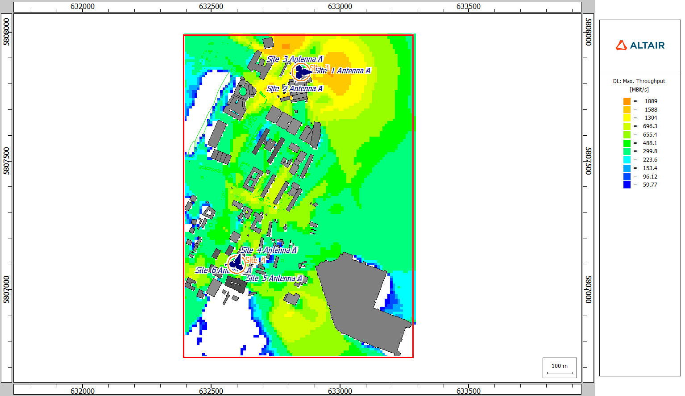

# 5G-NR3500-PUT-Campus-WinProp

This project simulates radio coverage and wave propagation for two Orange/T-Mobile shared NetWorks NR3500 TDD base stations in the area of the Poznan University of Technology campus and its nearby urban surroundings.

| Base station | Location | Infrastructure | Technology |
|---|---|---|---|
| Site 1 | ul. Św. Rocha 9, Poznan | Orange/T-Mobile shared NetWorks | NR3500 TDD |
| Site 2 | ul. Jana Pawła II 14, Poznan | Orange/T-Mobile shared NetWorks | NR3500 TDD |

### 1. Input data sources
* **OpenStreetMap** - map and urban area data used to prepare the simulation environment.
* **BTSearch** - map used to locate transmitters.
* **SI2PEM** - public database providing base station locations, technologies, frequency bands, and measurement reports (including antenna parameters such as azimuth, height, and downtilt).
* **Altair WinProp examples**
  * `5G TDD n79 100 MHz.wst` - used as the closest air interface template, with the frequency set to 3500 MHz.
  * `WiMax_3500MHz_60deg.apb` - used as an approximate 3500 MHz sector antenna pattern.

### 2. Urban Database Preparation and Preprocessing in WallMan

The urban model was created in **WallMan** from OpenStreetMap vector data (`kampus_PP.osm`) and converted into a WinProp urban database (`kampus_PP.odb`) containing buildings, vegetation and other physical obstacles affecting radio wave propagation. To improve the simulation workflow in ProMan, the environment was preprocessed using **Intelligent Ray Tracing (IRT)**.

### 3. ProMan Network Planning Project

A new network planning project was created in **ProMan** using the preprocessed urban database (`kampus_PP.oib`).

Key simulation parameters:
* **Technology:** 5G NR
* **Band:** NR3500
* **Duplex:** TDD
* **Carrier frequency:** 3500 MHz
* **Channel bandwidth:** 100 MHz
* **MIMO:** 8 streams
* **Prediction height:** 1.5 m
* **Prediction resolution:** 10 m

### 4. Base Station Configuration

The base stations were configured in **ProMan** as MIMO sites with directional sector antennas. The antenna configuration was based on SI2PEM data and an approximate 3500 MHz sector antenna pattern.

General antenna setup:
* **Antenna pattern:** `WiMax_3500MHz_60deg.apb`
* **Polarization:** X polarization ±45°
* **Antenna gain:** 17 dBi
* **Max. Tx Power:** 50 dBm EIRP (theoretical value).

#### Poznań, ul. Św. Rocha 9

| Sector | Azimuth | Downtilt | Antenna height |
|---|---:|---:|---:|
| Sector 1 | 18° | 7° | 34.5 m |
| Sector 2 | 135° | 7° | 37.5 m |
| Sector 3 | 265° | 7° | 37.2 m |

#### Poznań, ul. Jana Pawła II 14

| Sector | Azimuth | Downtilt | Antenna height |
|---|---:|---:|---:|
| Sector 1 | 90° | 7° | 19.5 m |
| Sector 2 | 209° | 7° | 19.5 m |
| Sector 3 | 330° | 7° | 19.5 m |

### 5. Simulation Results

#### RSRP Map

#### Downlink Throughput Map

#### Cell Area Map

### 6. Observations

